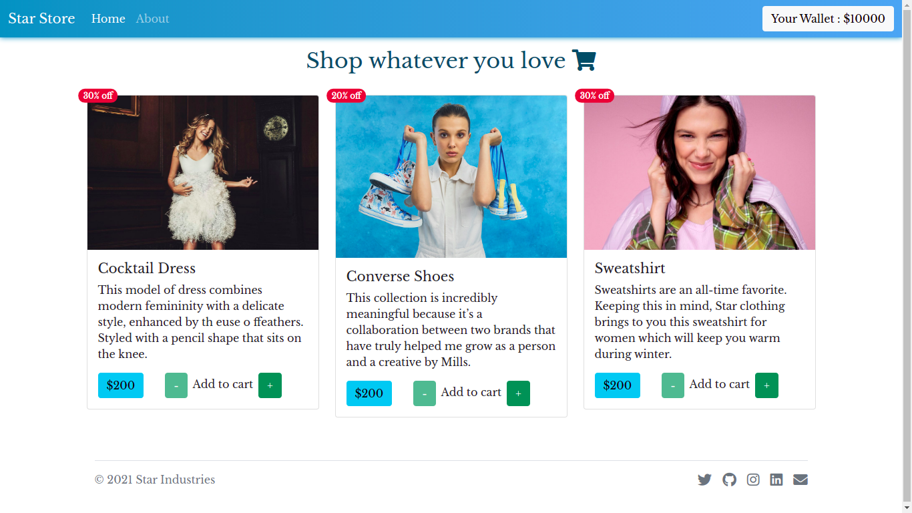

# 🛒️ Star Store App

  

 ### 🌀️ Basically, <strong>Star Store App</strong> is a shopping app in which user can select the product and add to cart, and also show the current wallet status. Basically this app is a use case of redux.

 ## 🚀️ App Preview
 https://star-store-app.vercel.app/

 ## 💻️ Tech Included
 <ul>
    <li>HTML</li>
    <li>CSS</li>
    <li>JavaScript</li>
    <li>Bootstrap</li>
    <li>React</li>
    <li>React Router</li>
    <li>Redux</li>
    <li>Font Awesome API</li>
</ul>

## 👨🏻‍💻️ Creator
Hey there, I'm Atul Tripathi from India. My passion for software lies with dreaming up ideas and making them come true with elegant interfaces. I take great care in the experience, architecture, and code quality of the things I build.
I am also an open-source enthusiast and maintainer. I learned a lot from the open-source community and I love how collaboration and knowledge sharing happened through open-source.

### 🔗 Links

### ❤️ Connect with me :  

## 🤓️ Support

🌀️ _If you like what i do, maybe consider buying me a coffee/tea 🥺👉👈_

For support, email atul31815@gmail.com.
## 🙏️ Contributing

Contributions are always welcome!

See `contributing.md` for ways to get started.

Please adhere to this project's `code of conduct`.

  
## 🔥️ Feedback

If you have any feedback, please reach out to us at atul31815@gmail.com.
  
## 🗞️ License

[MIT](https://choosealicense.com/licenses/mit/)